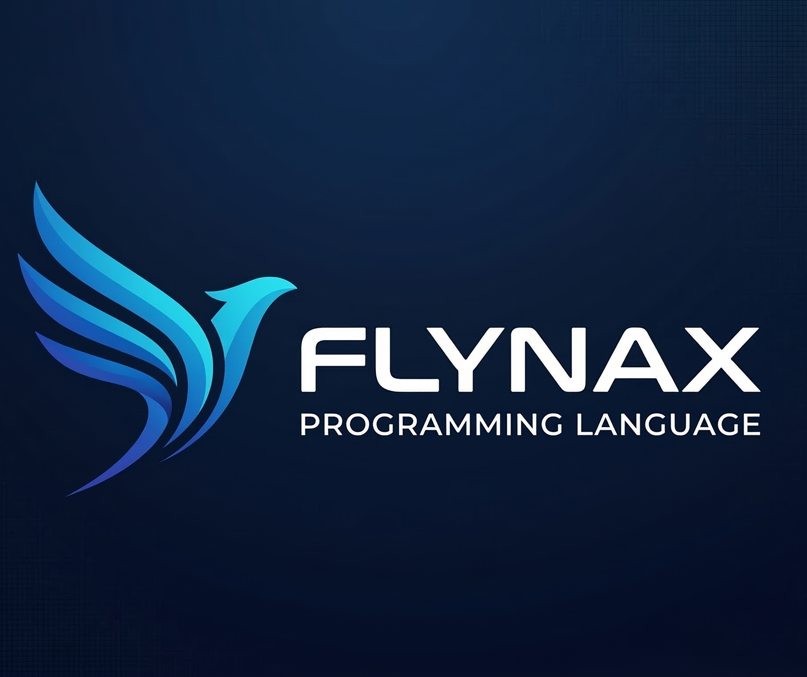

# ⚡ Flynax: The high-Performance "Beast" Language

**Flynax** is a modern, high-performance programming language designed to bridge the gap between **Python's readability** and **C++'s raw power**. Built on the world-class **LLVM** infrastructure, Flynax compiles directly to native machine code, delivering "Beast Mode" performance for systems, game, and web development.



---

## 🌟 Why Flynax?

In a world where you often have to choose between speed (C++) and developer happiness (Python), Flynax says: **"Why not both?"**

- **🚀 Native Performance**: No Virtual Machine. No Interpreter bloat. Compiles to optimized x64 and WASM binaries.
- **🐍 Clean Syntax**: Uses indentation for blocks. No curly brace fatigue. No semi-colons required.
- **🏗️ OOP from the Ground Up**: Classes with auto-constructors, methods, and `this` pointer support.
- **🔋 Full-Stack Power**:
  - **Game Engine**: Integrated SDL2 for graphics and animations.
  - **Database**: Native SQLite engine for fast, local storage.
  - **Web**: Built-in HTTP server, JSON parser, and WebAssembly target for browsers.
- **🛠️ Professional Toolchain**: Integrated package manager (`flpm`) and cloud registry.

---

## 💻 Ultra-Detailed Installation

We’ve made Flynax installation as smooth as possible. Follow the guide below based on your preference.

### 🌐 Method A: The Cloud One-Liner (Recommended)
This is the fastest way to get Flynax running on Windows. It downloads the compiler, sets up your environment, and configures your PATH automatically.

1.  Open **PowerShell** (as Administrator for best results).
2.  Run the following command:
    ```powershell
    powershell -Command "iwr -useb https://raw.githubusercontent.com/flynax-lang/flynex/main/setup.ps1 | iex"
    ```
3.  **Restart your terminal** and type `flynax --version`.

---

### 📦 Method B: Manual Setup (Full Control)
If you prefer to manage your own directories, follow these steps:

1.  **Download Binary**: Go to the [Releases](https://github.com/flynax-lang/flynex/releases) page and download `flynax-v0.1.0-win64.zip`.
2.  **Extract**: Extract the Zip to a permanent location, e.g., `C:\flynax`.
3.  **Configure Environment**:
    - Open the Start Menu, search for **"Edit the system environment variables"**.
    - Click **Environment Variables**.
    - Under **System variables**, find `Path`, select it, and click **Edit**.
    - Click **New** and add: `C:\flynax\bin`
    - Click OK on all windows.
4.  **Install LLVM (Backend)**: Flynax uses LLVM/Clang to link your code. Run:
    ```powershell
    winget install -e --id LLVM.LLVM
    ```

---

## 📝 Learning Flynax in 60 Seconds

### Classes & Objects
Flynax handles standard boilerplate for you. Notice how properties are declared right in the class signature!

```fx
class Player(string name, int health):
    
    heal(int amount):
        health += amount
        print(name + " now has " + health + " HP")

main():
    p = Player("Knight", 100)
    p.heal(20)
```

### Interactive I/O
Build interactive console apps with ease:

```fx
main():
    string input_val = input("Enter current power level: ")
    int power = string_to_int(input_val)
    
    if power > 9000:
        print("It's over 9000!!!")
    else:
        print("Keep training, beast.")
```

---

## 🛠️ Troubleshooting

- **"flynax is not recognized"**: Ensure you restarted your terminal after installation. Check your PATH variables.
- **"clang not found"**: Ensure you installed LLVM. Run `clang --version` to verify.
- **Linker Errors**: If you encounter `LNK` errors, ensure you have the Visual Studio C++ Build Tools installed.

For a full deep-dive into setup and common issues, see [INSTALLATION.md](./INSTALLATION.md).

---

## 🤝 Community & Support

- **Discord**: [Join the Flynax Beast Community](https://discord.gg/flynax) (Coming Soon)
- **Twitter**: [@FlynaxLang](https://twitter.com/flynaxlang)
- **Issues**: Found a bug? Open an issue on GitHub!

---

## 📜 License
Flynax is proudly Open Source under the **MIT License**.

Built with 🔥 by the Flynax Team.
